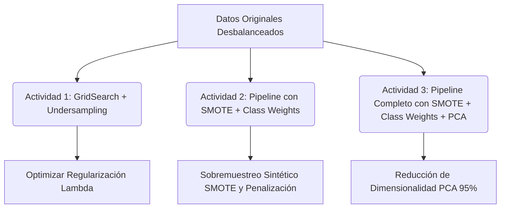

# Taller de Machine Learning - Semana 1: Regresión Lineal y Clasificación de Churn

Este repositorio contiene las guías de laboratorio y plantillas de código para el taller de la **Semana 1** del módulo de Machine Learning. El objetivo de este taller es dominar los conceptos básicos y avanzados de **Regresión Lineal** (regularización L1/L2 y aprendizaje online por mini-lotes) y la **Clasificación de Churn** en telecomunicaciones (manejo de datos desbalanceados con SMOTE, Pesos de Clase y PCA).

---

## 📂 Archivos del Taller

| Notebook | Descripción | Enlace al Archivo |
| :--- | :--- | :--- |
| **Regresión Lineal** | Pipelines, Regularización (Ridge/Lasso) y Aprendizaje Online (SGD) | [linear_regression.ipynb](file:///d:/OneDrive/Estudios/MAESTRIA%20CIENCIA%20DE%20DATOS/Machine%20Learning/Semana%201/linear_regression.ipynb) |
| **Clasificación Churn** | Predicción de abandono de clientes usando Regresión Logística | [Planteamiento_Clasificación_Churn_Telecomunicaciones_Logistic_Regression.ipynb](file:///d:/OneDrive/Estudios/MAESTRIA%20CIENCIA%20DE%20DATOS/Machine%20Learning/Semana%201/Planteamiento_Clasificaci%C3%B3n_Churn_Telecomunicaciones_Logistic_Regression.ipynb) |

---

## 🚚 Requisitos de Entrega

Para ambos laboratorios se deben entregar los siguientes elementos a través de la plataforma virtual:
1. **Archivo PDF** generado directamente en Google Colab ingresando al menú `Archivo` -> `Imprimir` (guardar como PDF).
2. **Enlace público de Google Colab** con los permisos configurados como *“Cualquier persona con el enlace puede ver/editar”*.

> [!IMPORTANT]
> Recuerde guardar una copia de cada notebook en su Google Drive personal (`Archivo` -> `Guardar una copia en Drive`) antes de comenzar a editar y resolver las actividades.

---

## 1. Guía de Trabajo: Regresión Lineal (`linear_regression.ipynb`)

El laboratorio se divide en dos secciones principales: **Pipelines y Regularización** (Ridge/Lasso) sobre el dataset de vivienda de California, y **Aprendizaje Online (Online Learning)** con descenso de gradiente estocástico (`SGDRegressor`) sobre el *Million Song Dataset* (MSD).

### 🛠️ Ejercicios a Resolver:

#### Parte 1: Pipelines y Regularización
- **[ ] Ejercicio 1.1 — Efecto del Grado Polinomial (Básico)**
  - Comparar los grados polinomiales de entrada `[1, 2, 3]`.
  - Construir un Pipeline para cada grado, realizar `GridSearchCV` usando la lista `ALPHAS` y registrar el mejor RMSE de validación cruzada y el mejor $\alpha$.
  - Generar y mostrar una tabla resumen con los resultados.
  - **Pregunta teórica:** ¿Un grado polinomial más alto siempre mejora el rendimiento en prueba? Explique por qué sí o por qué no.
- **[ ] Ejercicio 1.2 — Ridge vs. Lasso**
  - Implementar un pipeline utilizando `Lasso` (`PolynomialFeatures` -> `StandardScaler` -> `Lasso`) y ajustar `lasso__alpha` mediante `GridSearchCV`.
  - Comparar el RMSE en el conjunto de prueba obtenido por Ridge y Lasso.
  - Contar y comparar cuántos coeficientes del polinomio de grado 2 se reducen exactamente a cero en cada modelo.
  - **Visualización:** Graficar los 20 coeficientes no nulos más significativos de Lasso.

#### Parte 2: Aprendizaje Incremental (Online Learning) con `SGDRegressor`
- **[ ] Ejercicio 2.1 — Implementar el Bucle de Entrenamiento por Mini-Lotes (Básico)**
  - Instanciar un `SGDRegressor` (`loss='squared_error'`, `learning_rate='constant'`, `eta0=0.001`, `random_state=42`).
  - **Paso 1 (Escalador):** Iterar sobre los lotes (chunks) de los datos de entrenamiento y ajustar incrementalmente el escalador usando `StandardScaler.partial_fit`.
  - **Paso 2 (Entrenamiento):** Iterar nuevamente en chunks, transformar las variables regresoras $X$ con el escalador ajustado y llamar a `sgd.partial_fit(X_scaled, y_chunk)`. Registrar el RMSE de cada chunk en `chunk_rmses`.
  - Imprimir la cantidad de chunks procesados y el RMSE del último lote (esperado: ~10-11 chunks procesados, final RMSE ~8-11 años).
- **[ ] Ejercicio 2.2 — Graficar la Curva de Convergencia (Básico)**
  - Graficar el RMSE en el eje Y vs. el índice del chunk en el eje X para observar la evolución del aprendizaje dentro de la primera época.
  - **Pregunta:** ¿El modelo logra converger en una sola pasada de datos? Describa el patrón visualizado.
- **[ ] Ejercicio 2.3 — Entrenamiento Multi-Época (Intermedio)**
  - Cargar el conjunto de test omitiendo las filas de entrenamiento y escalarlo con el escalador ya entrenado.
  - Entrenar un nuevo `SGDRegressor` durante 10 épocas (`N_EPOCHS`). **Mezclar (shuffle) los datos al inicio de cada época**.
  - Registrar el RMSE del lote en entrenamiento y el RMSE de validación en test al finalizar cada época.
  - Graficar ambos RMSEs en una misma figura.
  - **Pregunta:** ¿Mejora el RMSE de validación en las últimas épocas? ¿En qué momento se estabiliza (satura)?
- **[ ] Ejercicio 2.4 — Exploración de la Tasa de Aprendizaje (Clave)**
  - Entrenar 5 modelos `SGDRegressor` independientes usando tasas `eta0` en `[0.0001, 0.001, 0.01, 0.1, 1.0]` por 1 época.
  - Detener anticipadamente (early stop) las ejecuciones que produzcan valores `NaN` o `inf`.
  - Graficar las curvas de convergencia comparativas (limitar eje Y a 150 años).
  - **Preguntas:**
    - ¿Qué tasas de aprendizaje divergen?
    - ¿Por qué una tasa grande provoca divergencia? Explique la geometría de este comportamiento.
    - ¿Cuál es la desventaja de emplear una tasa extremadamente baja?
- **[ ] Ejercicio 2.5 — Programación de Tasas de Aprendizaje (Schedules - Avanzado)**
  - Entrenar tres modelos por 3 épocas usando diferentes esquemas de tasa: `constant` ($\eta_0 = 0.001$), `optimal` (esquema automático de scikit-learn) e `invscaling` ($\eta_0 = 0.001$, `power_t=0.25`).
  - Evaluar y registrar el RMSE en test tras cada época.
  - Graficar el RMSE de validación vs. la época para las tres variantes.
  - **Pregunta:** ¿Qué programación de tasa alcanza el menor error? Analice el compromiso entre tasas constantes y decrecientes ante flujos de datos continuos con posible cambio de distribución (*concept drift*).

---

## 2. Guía de Trabajo: Clasificador Churn (`Planteamiento_Clasificación_Churn_Telecomunicaciones_Logistic_Regression.ipynb`)

El objetivo es construir y evaluar un modelo de Regresión Logística optimizado para predecir si un cliente abandonará la empresa de servicios de telecomunicaciones (`Churn`). Dado que el conjunto de datos original está desbalanceado (3 a 1 a favor de clientes activos), se exploran diferentes métodos para contrarrestar este desbalance y mejorar el **Recall**.

### 🛠️ Actividades a Resolver:

- **[ ] Actividad 1: Optimización de Regularización y Evaluación de Métrica**
  - Construir un gráfico donde el eje X represente la regularización lambda (`lambda_value`) en escala logarítmica para los valores `[1e-4, 1e-3, 1e-2, 0.1, 1, 10, 100, 1e3, 1e4]`, y el eje Y muestre el **recall**.
  - Incluir las curvas de recall tanto para el conjunto de entrenamiento como para validación.
  - Utilizar `GridSearchCV` con validación cruzada de 5 folds (o implementar `Optuna`) para identificar el valor de regularización óptimo.
  - Evaluar el modelo final optimizado en el conjunto de prueba y reportar tanto el **accuracy** como el **recall**.
  - **Pregunta:** ¿Por qué considera que el recall es una métrica más adecuada para este problema? Analice el impacto de reducir los falsos negativos en la retención de clientes.
- **[ ] Actividad 2: Tratamiento del Desbalance mediante SMOTE y Pesos de Clase**
  - Implementar un Pipeline de scikit-learn utilizando el dataset completo y original (sin aplicar el submuestreo de la Actividad 1).
  - El pipeline debe incorporar:
    1. **Sobremuestreo:** Generación sintética de muestras de la clase minoritaria mediante SMOTE (`imblearn.over_sampling.SMOTE`).
    2. **Pesos de Clase:** Penalización de errores en la clase minoritaria asignando pesos de clase ajustados (`sklearn.utils.class_weight.compute_class_weight`) al modelo de Regresión Logística.
  - Evaluar la exactitud (accuracy) en el conjunto de prueba y comparar las conclusiones obtenidas con respecto al submuestreo de la Actividad 1.
- **[ ] Actividad 3: Integración de SMOTE, Pesos de Clase y PCA**
  - Construir un Pipeline secuencial estructurado con los siguientes pasos:
    1. `PolynomialFeatures`
    2. `StandardScaler`
    3. `PCA` (ajustado para retener el 95% de la varianza explicada)
    4. `LogisticRegression` (con pesos de clase incorporados)
  - Entrenar este pipeline sobre el conjunto completo de datos y evaluar el accuracy, recall y otras métricas relevantes en el conjunto de prueba.
  - **Pregunta:** ¿Cómo afecta la reducción de dimensionalidad con PCA, en combinación con SMOTE y pesos de clase, al rendimiento general del modelo?
- **[ ] Conclusiones**
  - Redactar un resumen final del trabajo que consolide sus principales aprendizajes, comparaciones métricas y recomendaciones prácticas para resolver problemas de regresión regularizada y clasificación desbalanceada.
